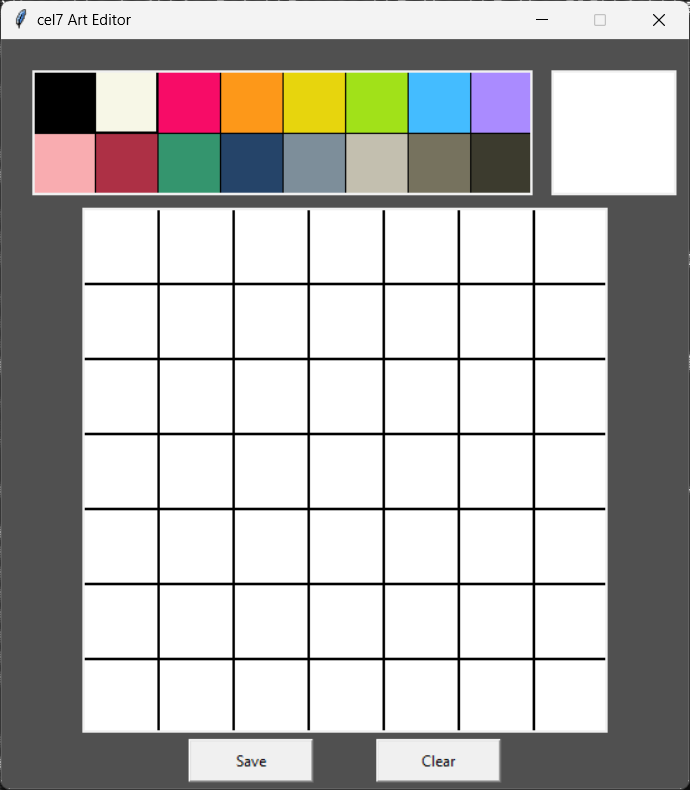

# cel7-sprite-editor
A bare minimum sprite editor for cel7 framework

## How to use
White cells on the editing canvas are the filled ones, click them to un-fill, theres a preview thingy on the top right where you can see how it looks without grid lines. The sprite can be of only one color so select it from the color pallet, and it will show up on the preview pane as well. After you are done with making the sprite, click on save which will open a window showing the Byte-like art and the color index, press copy to clipboard to copy the Byte-like art and paste it in your code, use the color displayed on the screen when putting on screen to get the same color. press clear button to reset the canvas.
To load the sprites, use the `loadSprites.c7` file along with your code.
With that, you can load sprites like this:
```lisp
(loadSprites '(
    ;a
    0 1 1 1 1 1 0 
    1 1 1 1 1 1 1 
    1 0 1 1 1 0 1 
    1 1 1 1 1 1 1 
    1 0 1 1 1 0 1 
    1 1 0 0 0 1 1 
    0 1 1 1 1 1 0 
))
(= step (fn ()
    (fill 0 0 width height " ")
    (color 4)
    (put 0 0 "a")
))
```
just look at `test.c7`

Similar tool: [PossiblyAxolotl's Cel7 Art Tool](https://possiblyaxolotl.itch.io/cel7-art-tool)

## screenshot
